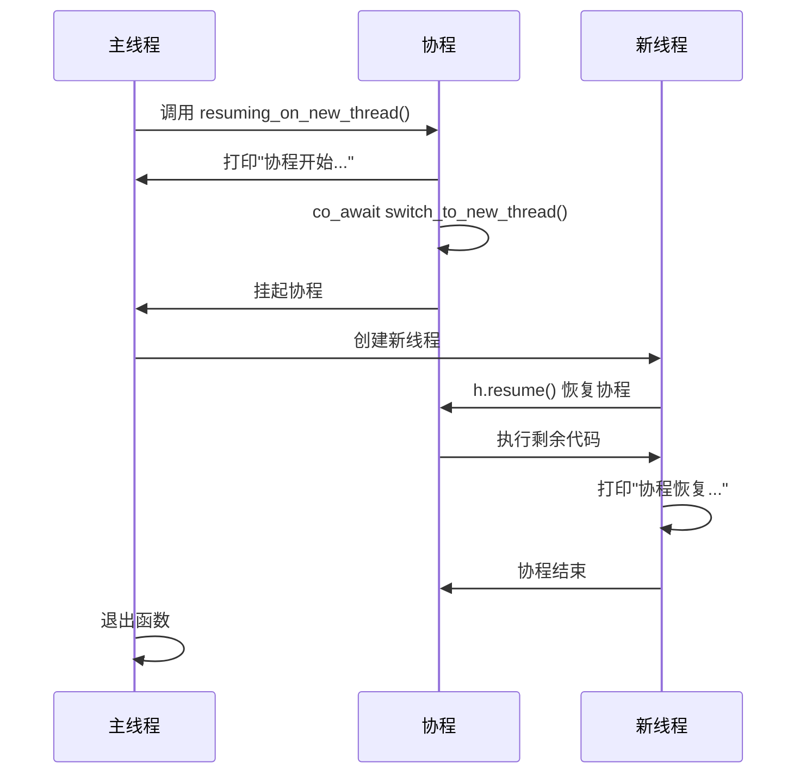
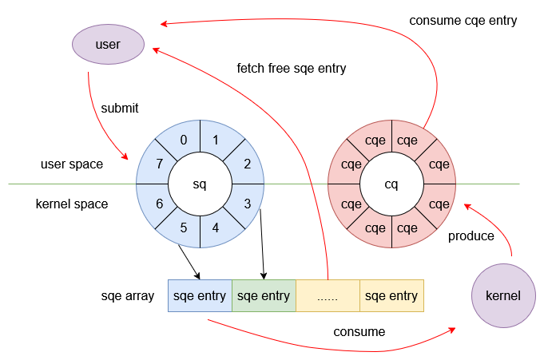

# C++协程入门

## 有栈协程VS无栈协程

- 对称协程：所有协程独立且平等，调度权可在任意协程间进行转移，公平式调度。
- 非对称协程：协程之间存在调用关系，如果协程让出调度权目标一定是调用者（发起调用的一方）。

### 有栈协程ucontext 
```c
/* Userlevel context.  */
typedef struct ucontext_t
  {
    unsigned long int __ctx(uc_flags);
    // 表示当前 context 执行结束后下一个待执行的 context
    struct ucontext_t *uc_link;
    // 存储当前 context 的上下文栈信息
    stack_t uc_stack;
    // 存储当前 context 的上下文寄存器信息
    mcontext_t uc_mcontext;
    // 存储当前线程的信号屏蔽码
    sigset_t uc_sigmask;
    struct _libc_fpstate __fpregs_mem;
    __extension__ unsigned long long int __ssp[4];
  } ucontext_t;
```
```c
/* 获取当前上下文信息并将其存储到 ucp 指向的 context 中 */
int getcontext (ucontext_t *__ucp);

/* 将当前上下文切换到设置为 ucp 指向的 context */
int setcontext (const ucontext_t *__ucp);

/* 组合操作，获取当前上下文信息并将其存储到 oucp 指向的 context 中并将当前上下文切换到设置为 ucp 指向的 context */
int swapcontext (ucontext_t *__restrict __oucp, const ucontext_t *__restrict __ucp);

/* 设置 ucp 指向的 context 入口函数为 func  */
void makecontext (ucontext_t *__ucp, void (*__func) (void), int __argc, ...);
```

### libco / libgo


### 无栈协程
把整个协程抽象成一个类，以原本需要执行切换的语句处为界限，把函数划分为几个部分，并在某一个部分执行完以后进行状态转移，在下一次调用此函数的时候就会执行下一部分，这样的话我们就完全没有必要像有栈协程那样显式的执行上下文切换了，只是需要自行实现协程切换的调度逻辑，所有的协程共用的都是一个栈，即系统栈，也就不必自行去给协程分配栈，因为是函数调用，我们当然也不必去显式的保存寄存器的值。

而且相比有栈协程把局部变量放在新开的空间上，无栈协程直接使用系统栈使得 CPU cache 局部性更好，同时也使得无栈协程的中断和函数返回几乎没有区别，这样也可以凸显出无栈协程的高效，不过正因为无栈协程不会为栈信息开辟内存空间（`注意无栈协程仍然需要内存空间存储当前状态`，只是存储的内容与有栈协程不同），它无法实现在任意函数调用层级的位置进行挂起，因此无栈协程通常也是非对称协程。

# C++协程
C++ 协程正是通过内置的关键字将函数进行了切分，按官方的话说是可以在切分处进行 suspend 或 resume，我更愿意将切分处解释为一个调度点，在调度点处用户决定是否切换协程或者切换到哪个协程。

当 C++ 的函数包含指定关键字（`co_await`，`co_yield`，`co_return`）时，编译器会将其看作协程，而在关键字出现的地方编译器会安插调度点，在调度点用户可以使用协程的方法来指定协程是继续运行还是选择切换执行流程。

C++ 协程设计了多种类型的调度点，我们梳理一下这些调度点。
- 协程创建时。此处安插调度点主要是方便用户对即将运行的协程做一些准备工作，即协程创建后不必立刻运行，等某些逻辑（例如发起的 IO）完成后再执行。
- 协程中每次调用 `co_await` 处。运行过程中调度点主要是为协程切换做准备，用户可在此决定是否切出当前协程，或执行自定义的调度器逻辑。
- 协程销毁时。此处的调度点主要是为了确定接下来运行哪个协程，比如 A 协程调用了 B 协程，B 协程执行完之后可以选择切换到 C 协程执行或者把执行权交回 A 协程。注意该调度点之后会执行协程销毁，所以用户不要在此调度点让当前协程继续运行，一般是选择回到父协程或其他协程，否则会出现 core dump。

## C++ 协程的定义和执行
如果我们在 C++ 的函数体里添加了 `co_await`，`co_return` 或者 `co_yield` 关键字（必须有其一），那么该函数即视为协程。而被视作协程的函数也会受到诸多限制，例如不可以使用 return 语句，构造函数、析构函数、main 函数和 constexpr 函数均不能成为协程。

每一个协程函数都对应着一个协程对象，而协程对象与下述三种类型的数据相关联。
- **promise 对象**。注意这里的 promise 仅仅是个概念名词，和 C++ 异步编程里的 std::promise 没有任何关联。协程的构造和运行需要编译器做很多幕后工作，而 promise 是编译器直接暴露给用户的一个对象，其与协程的运行状态相关联，用户可以通过 promise 的预定义方法实现调度协程、获取运行结果和异常捕获。
- **协程句柄**。协程句柄本质是一个指针，通过协程句柄用户可以访问对应的 promise 以及恢复和销毁协程。
- **协程状态**。协程为了实现随时暂停执行并随意恢复的功能，必须在内存空间中保存当前的协程状态，主要涉及协程当前运行位置（便于恢复时继续运行）以及生命周期未结束的局部变量。

上述三种对象可合称为协程帧，协程句柄和 promise 可以互相转换以及可以利用协程句柄执行协程的恢复和销毁。


通常激活帧被称作一块保留了函数运行状态的内存，对于普通函数激活帧就是栈帧，而对于协程激活帧由两部分组成：
- 栈帧。与普通函数栈帧结构类似，在调用协程时产生栈帧，协程结束返回给调用者时释放栈帧。
- 协程帧。用于记录协程中间状态便于协程暂停和恢复执行，主要包含上述介绍的三种与协程相关的数据对象。关于协程帧有两点需要注意：
    - 在创建协程时由编译器分配内存，但注意该内存需要用户手动释放，否则会造成内存泄漏。
    - 通常采用堆分配方式构建协程帧。c++ 协程提案中有一些规定，如果编译器能够证明协程的生命周期确实严格嵌套在调用者的生命周期内，则允许从调用者的激活帧中分配协程帧的内存。

综上分析，调用者调用协程会执行大概两步：`第一步像调用正常函数一样构造栈帧`，`第二步编译器分配内存构造协程帧`。这也解释了为何 C++ 协程的激活帧会分为两部分，第一步操作符合严格嵌套关系所以可被放在栈空间，第二步操作不符合严格嵌套所以利用额外的堆空间存储。

## Promise
[promise 示例](./core_basic/01_promise.cc)


### promise 构造
1. 构造时机：当协程被调用时（run(5)），编译器会在执行函数体前自动构造 promise 对象
2. 构造方式：promise 对象总是通过默认构造函数构造

当调用 run(5) 时，编译器会生成类似这样的伪代码：
```cpp
// 1. 分配协程帧内存
void* frame = operator new(sizeof(coroutine_frame));

// 2. 在帧中构造promise（使用默认构造函数）
promise_type* promise = new (frame) promise_type();

// 3. 在帧中存储协程参数
int& i = *new (frame + offset) int(5);  // 存储参数值5

// 4. 调用get_return_object获取Task对象
Task task = promise->get_return_object();

// 5. 处理初始挂起
if (promise->initial_suspend().await_ready() == false) {
    // 挂起协程（本例中返回suspend_always）
    return task;  // 返回给调用者
}

// 6. 如果未挂起，则开始执行协程函数体
// ... 执行 run 的函数体 ...
```

### get_return_object
```cpp
Task get_return_object() // 用于构造协程（编译器生成调用代码）
{
    auto handle = handle_type::from_promise(*this);
    return Task(handle);
}
```
用户调用协程时获取的 UserFacing 对象是编译器通过 promise 的 get_return_object 函数构造出来的，该函数参数为空，返回类型需要与协程的返回类型一致。
> `std::coroutine_handle<promise_type>::from_promise(promise_type&)` 方法并传入 promise_type 对象的引用（引用类型需要与方法的模板参数保持一致）可以获得 promise 对象对应的 coroutine_handle，通常的做法会将 coroutine_handle 作为 UserFacingd 构造函数的参数，这样 UserFacing 便可以访问 promise 持有的数据

### initial_suspend (调度点)
当用户调用协程并构造完协程帧后，编译器会调用协程关联的 promise 对象的 initial_suspend 方法通过返回的 awaiter 来决定是直接运行协程还是暂停执行转移控制权。C++ 官方提供了默认的 awaiter 实现：
- `std::suspend_always`。暂停协程执行，执行权返回给调用者。
- `std::suspend_never`。协程继续执行。

> 备注：调用 对应的 协程函数，都会返回 子协程的task

### final_suspend (调度点)
与 initial_suspend 类似，final_suspend 函数负责协程执行结束后的调度点逻辑，返回值同样是 awaiter 类型，用户可以通过自定义 awaiter 来转移执行权，也可以直接返回 std::suspend_alaways 或者 std::suspend_never  
调用 final_suspend 会执行的逻辑

> 换句话说，如果 final_suspend 返回了 suspend_never，那么编译器会接着执行后续的资源清理操作，如果 UserFacing 在析构函数中再次执行 handle.destroy，那么会出现 core dump，所以`一般建议不要返回 suspend_never`，因为资源的释放最好在用户侧来做。

### co_return & return_value
协程的 co_return 就像普通函数的 return 一样，用于终止协程并选择性的返回值。根据 co_return 是否返回值，编译器会做出不同的处理：
- 不返回值。此时 co_return 仅用于终止协程执行，编译器随后调用 promise.return_void 方法，此函数可实现为空，在某些情况下也可以执行协程结束后的清理工作，但用户必须为 promise 定义 return_void 方法。
- 返回值。假设 co_return 返回值的类型为 T，此时编译器调用 promise.return_value 方法，并将 co_return 的返回值作为参数传入，用户可以自定义 return_value 函数的参数类型，就像调用正常函数一样，只要 T 可以转换为该参数类型即可。样例程序中因为 co_return 返回了值，所以 promise_type 也增添了一个成员函数用于存储该值，在 return_value 函数体内完成赋值。
> 需要注意的是 C++ 标准规定 promise_type 定义的函数里 return_value 和 return_void 函数`不能同时存在`，并且当协程不存在 co_return 关键字时用户也需要定义 return_void 方法，因为协程执行结束后编译器会隐式调用该函数。


### co_yield & yield_value (调度点)
co_yield 用于协程在运行过程中向外输出值。与 co_return 类似，我们也需要在 promise 中为其新增成员变量，当执行到 co_yield 语句时，编译器调用 yield_value 方法，co_yield 的值作为参数，函数体内将该值赋予给 promise 成员变量。外部访问该 co_yield 的值的流程与 co_return 类似。

与 co_return 不同的是，co_yield 之后协程的运行并不一定结束，所以 yield_value 通过返回 awaiter 类型来决定协程的执行权如何处理，一般返回 std::suspend_alaways 转移控制权到调用者，用户也可返回自定义的 awaiter，但通常不要返回 std::suspend_never 等让协程继续运行的 awaiter，因为此时协程继续运行的话如果再次碰到 co_yield 那么上次 yield 的值就会被覆盖。

### unhandled_exception (隐式调度点)

如果协程在运行过程中抛出了异常且没有捕获，那么协程的运行会提前终止，且无法通过 coroutine_handle 恢复协程。此时编译器调用 promise 的 unhandled_exception 方法，该方法没有参数，我们通常实现该函数为利用标准库提供的 std::current_exception 方法获取当前发生的异常，并将异常作为变量存储，注意异常不会再向上传播。此时控制权转移到协程调用者，用户可以在 UserFacing 的方法中获取存储的异常，并再次抛出异常，如样例程序中 Task 的 next 方法所示。


Q: 为何普通函数在抛出异常未捕获后异常会一直向上传递直到被捕获，而协程抛出异常未捕获却并不会向上传递？

A: C++ 协程关于异常处理的流程如下所示，编译器为我们隐式的添加了 try/catch 语句，因此异常并不会传播到调用者。综合来看 C++ 协程的设计者通过 unhandled_exception 使得协程的异常处理更加灵活。
  ```cpp
  try{
  // coroutine body
  } catch {
  promise.unhandled_exception();
  }
  ```

## Awaiter
之前的 Promise 通过 C++ 提供的多种类型的 Awaiter 实现 调度
```cpp
struct suspend_always
{
  constexpr bool await_ready() const noexcept { return false; }
  // 挂起协程，返回调用者
  constexpr void await_suspend(coroutine_handle<>) const noexcept {}  
  constexpr void await_resume() const noexcept {}
};
struct suspend_never
{
  constexpr bool await_ready() const noexcept { return true; }
  constexpr void await_suspend(coroutine_handle<>) const noexcept {}
  constexpr void await_resume() const noexcept {}
};
```

C++ 协程标准要求 awaiter 必须实现下列三个方法：
- await_ready
- await_suspend
- await_resume 协程恢复时调用，返回值作为 co_await 表达式的结果
> 当协程执行 co_await 表达式时按固定顺序调用。

### co_await: awaiter 执行的触发器


### await_ready
用户代码执行 co_await awaiter 时，编译器首先执行 awaiter.await_ready 方法，该方法返回 bool 类型
- 如果是 true，如同字面意思 ready 一样，代表当前协程已就绪，当前协程选择继续运行而非暂停，并且 await_suspend 方法不会被调用。
- 反之，暂停运行，调用 awaiter.await_suspend

> 补充：当父协程通过co_await等待子协程时：await_ready返回false，表示子协程未完成，父协程需挂起；

### await_suspend
```cpp
// 函数原型 1
void awaiter::await_suspend(std::coroutine_handle<>);
// 函数原型 2
bool awaiter::await_suspend(std::coroutine_handle<>);
// 函数原型 3
std::coroutine_handle<> awaiter::await_suspend(std::coroutine_handle<>);
```

await_suspend 参数为当前协程的 coroutine_handle，返回值有三种形式：
- void。当前协程暂停，执行权返回给当前协程的调用者。
- bool。如果值为 true 则协程暂停，执行权返回给当前协程的调用者，否则协程继续运行。（避免不必要的挂起）
- coroutine_handle。返回的协程句柄会被编译器隐式调用 resume 函数，即`该句柄关联的协程会继续运行`，也可直接返回参数中的协程句柄，这意味着当前协程会继续运行。
> 注意返回值为 coroutine_handle 时，如果想转移协程执行权，C++ 内置了 std::noop_coroutine 类，返回该类代表使协程处于 suspend 状态。(如，异步操作已同步完成时，无需挂起协程，可直接返回结果)

### await_resume
在讲解 promise 一节中我们提到协程通过 co_return 返回值，协程的调用者通过 UserFacing 的方法获取该返回值，但获取返回值的过程不够优雅。如果协程返回的 UserFacing 可以被转换为 awaiter 且调用者也是协程的话可以有更简洁的写法：
```cpp
// 写法 1
UserFacing obj = run();
T value = obj.get_return_value();

// 写法 2（需要在协程体内）
T value = co_await run();
```

### awaiter 生命周期

如果在执行了 co_await 操作后产生了临时的 awaiter 对象，那么在执行完 await_resume 后编译器会立刻执行 awaiter 的析构，对于非临时 awaiter 就是随着作用域结束析构。

## 协程间的状态转移


## 示例代码
[](./core_basic/02_awaiter.cc)


Q: 💡思考题：如果将 Event 的 await_suspend 方法返回值改成 global_handle，那么示例的运行时图需要怎样修改？
```
construct task 0
task 0 start
construct task 1
task 1 start
task 1 will suspend
event construct
task 1 will suspend
back to main
task 1 end
run finish
deconstruct task 0
```
Q 第二次挂起后 控制流 回 main 的原因  
A 恢复 run(1) 的是协程运行时机制，最终控制权回到最初启动整个协程的上下文：main()

Q 为什么不是返回 run(0)
- run(0) 的状态：
  - run(0) 在 co_await run(1) 处已被挂起
  - 它没有主动恢复 run(1)，而是通过 await_suspend() 机制间接触发的(可以理解为，await_suspend返回run(1)，此时run(0)回到main，是main隐式调用run(1) resume())

- 恢复链断裂：
  - run(1) 不是由 run(0) 直接恢复的
  - 恢复操作发生在协程运行时内部
  - 当协程挂起时，运行时只能将控制权返回给最外层的调用上下文

- C++ 协程规范：
  - 当 await_suspend 返回 void 时，协程挂起后将控制权返回给当前协程的调用者/resumer
  - 如果协程不是由另一个协程直接恢复的，则最终返回到初始调用者


## 线程间调度协程
[线程间调度协程](./core_basic/03_thread.cc)


# io_uring
[Linux 异步 I/O 框架 io_uring：基本原理、程序示例与性能压测（2020）](https://arthurchiao.art/blog/intro-to-io-uring-zh/)

epoll() 对 storage files 不支持：
- 读操作​：文件始终被视为“可读”，因为数据已存在于磁盘（或缓存）中，但实际读取时可能因缓存未命中而阻塞。
- 写操作​：文件始终被视为“可写”，但写入速度受磁盘 I/O 带宽限制，实际仍可能阻塞。

Linux AIO 问题
- 只支持 O_DIRECT 文件。
- 并非完全非阻塞，在某些情况下会出现接口阻塞的行为且难以预料。（内存不足，文件描述符（fd）限制...）
- 接口拓展性较差。

# io_uring 实现原理
io_uring 实现异步 I/O 的本质是利用了一个生产者 - 消费者模型，每个 uring 在初始化时会在内核中创建提交队列（sq）和完成队列（cq），其数据结构均为固定长度的环形缓冲区。用户向 sq 提交 I/O 任务，内核负责消费任务，完成后的任务会被放至 cq 中由用户取出，为了降低用户态与内核态之间的数据拷贝，io_uring 使用 mmap 让用户和内核共享 sq 与 cq 的内存空间。具体可以看下图所示：


从图中可以看出核心数据并不存储在 sq 中，而是存储在 sqe array 中，sqe array 包含多个 sqe entry（sqe），每个 sqe 是一个结构体存储了 I/O 请求的详细信息，比如操作类型、缓冲区地址、缓冲区长度和文件描述符等等，sq 只存储索引项，用户操作的完整流程包含如下步骤：
- 用户调用接口获取空闲的 sqe entry 并填充 I/O 信息。
- 用户向 sq 提交 sqe，sq 记录其索引信息。
- 内核从 sq 获取 sqe entry 并处理，完成后将结果封装成 cqe entry 放入 cq 中，cqe entry 存储了 I/O 操作的结果。
- 用户从 cq 中获取 cqe entry，处理结束后标记该 cqe entry，这样相关联的 sqe entry 回到空闲状态等待再利用。

# io_uring_setup
```c
int io_uring_setup(unsigned entries, struct io_uring_params *params);
```
- 功能：创建 io_uring 实例。
- 参数 entries：用户期望的完成队列的大小，即队列可容纳 I/O 请求的数量。
- 参数 params：一个指向 io_uring_params 结构体的指针，该结构体用于返回 io_uring 实例的相关参数，如实际分配的 SQ 和完成队列（CQ）的大小、队列的偏移量等信息。
- 返回：io_uring 实例的文件描述符。

用户在使用 io_uring 前需要调用io_uring_setup接口创建 io_uring 实例，内核会根据参数为其分配内存空间，成功后会返回与该 io_uring 绑定的文件描述符，后续操作均基于该文件描述符。

# io_uring_enter
```C
int io_uring_enter(int fd, unsigned int to_submit, unsigned int min_complete, unsigned int flags, sigset_t *sig);
```
- 功能：将 SQ 中的 I/O 请求提交给内核，并可选择等待完成事件（CQE）返回
- 参数 fd：io_uring 实例对应的文件描述符。
- 参数 to_submit：用户准备提交的 I/O 请求的数量。
- 参数 min_complete：函数在返回前至少要完成的 I/O 请求数量。
- 参数 flags：用于控制 io_uring_enter 的行为。

一般用户通过 `io_uring_submit` 函数提交 I/O 请求，而该函数内部实现正是通过io_uring_enter。

# io_uring_register
```c
int io_uring_register(unsigned int fd, unsigned int opcode, void *arg, unsigned int nr_args);
```
- 功能：用于预先注册文件描述符、缓冲区、事件文件描述符等资源到 io_uring。
- 参数 fd：io_uring 实例对应的文件描述符。
- 参数 opcode：表示注册的类型。
    - IORING_REGISTER_BUFFERS：注册缓冲区数组，内核直接引用用户内存（零拷贝）。
    - IORING_REGISTER_FILES：注册文件描述符数组，避免每次 I/O 重复查找 fd
- 参数 arg：指针指向与 opcode 相关联的内容。

通过io_uring_register注册文件描述符或缓冲区等资源后，内核在处理 I/O 请求时，可以直接访问这些预先注册的资源，而无需每次都重新设置相关信息，从而提高了 I/O 操作的效率。例如，在进行大量文件读写操作时，预先注册文件描述符可以避免每次提交 I/O 请求时都进行文件描述符的查找和验证，减少了系统开销，提升了 I/O 性能。

> 💡每次提交 I/O 前进行系统调用会不会很影响性能？
> 答案是会的，而 io_uring 的设计者也考虑到了这一点，用户可以在初始化 io_uring 实例时添加IORING_SETUP_SQPOLL这个 flag，这样内核会额外启动一个 sq 线程自动去 poll 请求队列，此时用户调用io_uring_submit并不会涉及到系统调用，也就是不会调用io_uring_enter，这样减少系统调用次数来提高效率，不过为了防止 sq 线程在 poll 的过程中导致系统 CPU 占用过高，因此在指定时间后如果没有任何请求，那么 sq 线程会陷入休眠状态，此时需要调用io_uring_enter来唤醒 sq 线程。

# liburing 实战
[liburing](./core_basic/04_io_uring.cc)


# tinyCoroLab Lab1
[tinyCoroLab/include/coro/task.hpp](./tinyCoroLab/include/coro/task.hpp)

从四个关键点梳理
## 1. 直接调用 协程函数 
```cpp
// 1. 分配协程帧内存
void* frame = operator new(sizeof(coroutine_frame));

// 2. 在帧中构造promise（使用默认构造函数）
promise_type* promise = new (frame) promise_type();

// 3. 在帧中存储协程参数
int& i = *new (frame + offset) int(5);  // 存储参数值5

// 4. 调用get_return_object获取Task对象
Task task = promise->get_return_object();

// 5. 处理初始挂起
if (promise->initial_suspend().await_ready() == false) {
    // 挂起协程（本例中返回suspend_always）
    return task;  // 返回给调用者 (就类似于调用函数，task是返回值)
}

// 6. 如果未挂起，则开始执行协程函数体
// ... 执行 run 的函数体 ...

// 7. 挂起后，需要调用 task.resume() 恢复子协程运行~ 
```

## 2. co_return
因为return_value和return_void不能同时存在。
所以存在 类
```cpp
struct promise_base

template<typename return_type>
struct promise final : public promise_base, public container<return_type>
// container<return_type> 模板类里实现了 return_value， result(返回co_return值)

template<>
struct promise<void> : public promise_base
// 实现了 return_void
```
> co_return 的值保存在 container<return_type>，调用 promise.result() 获取。

## 3. co_await
子协程结束后 / 中断后，co_await task 调用 `auto operator co_await() const& noexcept` 的得到 `co_await awaitable{m_coroutine}` 。传入当前句柄。   
> 所以，这里指向的 awaitable 操作的子协程句柄
- await_ready 判断 协程句柄可用性。可用即接着调用await_suspend
- await_suspend 此时，awaitable_base里保存的是子协程句柄，传参是awaiting_coroutine父协程句柄。（此时是绑定 父子协程关系的最佳时刻~）
- await_resume 的调用时机 （补充）
    - 若协程未挂起（即await_ready()返回true），await_resume会紧随await_ready()之后同步调用，协程继续执行而不暂停
    - 若协程被挂起（即await_ready()返回false），则在后续通过coroutine_handle::resume()恢复协程时，​**恢复点之后的第一个操作就是调用await_resume**
- await_resume 的返回值保存在 父协程的上下文中，不会被 co_return 覆盖

```cpp

struct awaitable_base
{
    awaitable_base(coroutine_handle coroutine) noexcept : m_coroutine(coroutine){}

    auto await_ready() const noexcept -> bool { return !m_coroutine || m_coroutine.done(); }

    auto await_suspend(std::coroutine_handle<> awaiting_coroutine) noexcept -> std::coroutine_handle<>
    {
        // TODO[lab1]: Add you codes
        // 传入的 awaiting_coroutine 是 co_wait fun（子协程结束或suspend后）父协程的句柄
        m_coroutine.promise().continuation(awaiting_coroutine);
        return m_coroutine;
    }
    // struct awaitable继承后，co_await()里{}初始化已经赋值了，当前tast的句柄
    std::coroutine_handle<promise_type> m_coroutine{nullptr};
};

auto operator co_await() const& noexcept
{
    struct awaitable : public awaitable_base
    {
        // 获取到 协程内 co_return 的返回值
        auto await_resume() -> decltype(auto) { 
            return this->m_coroutine.promise().result();    // 返回 co_return 的值
        }
    };
    // 把当前句柄传入
    return awaitable{m_coroutine};
}
```

## promise_type 关键
```cpp
struct promise_base
{
    friend struct final_awaitable;
    struct final_awaitable
    {
        // 挂起  接着调用 await_suspend
        constexpr auto await_ready() const noexcept -> bool { return false; }
        // 子协程结束的时候，返回父协程句柄
        template<typename promise_type>
        auto await_suspend(std::coroutine_handle<promise_type> coroutine) noexcept -> std::coroutine_handle<>
        {
            // coroutine 子协程
            auto& promise = coroutine.promise();
            return promise.m_continuation != nullptr ? promise.m_continuation : std::noop_coroutine();
        }

        constexpr auto await_resume() noexcept -> void {}
    };

    promise_base() noexcept = default;
    ~promise_base()         = default;

    constexpr auto initial_suspend() noexcept { return std::suspend_always{}; }

    [[CORO_TEST_USED(lab1)]] auto final_suspend() noexcept
    {
        // TODO[lab1]: Add you codes
        // Return suspend_always is incorrect,
        // so you should modify the return type and define new awaiter to return
        // 备注：每个调度点返回，会隐形调用 co_await awaitable(返回值)
        return final_awaitable{}; 
        // 此处 和 在父协程调用了 co_await 不同。
        // 在子协程上下文执行 co_await final_awaitable，目的返回子协程的父协程句柄
    }

    auto continuation(std::coroutine_handle<> continuation) noexcept -> void { m_continuation = continuation; }

    auto set_state(coro_state state) -> void { m_state = state; }

    auto get_state() -> coro_state { return m_state; }

    auto is_detach() -> bool { return m_state == coro_state::detach; }

protected:
    std::coroutine_handle<> m_continuation{nullptr};
    coro_state              m_state{coro_state::normal};
};

template<typename return_type>
struct promise final : public promise_base, public container<return_type>
{
public:
    using task_type        = task<return_type>;
    using coroutine_handle = std::coroutine_handle<promise<return_type>>;

    promise() noexcept {}
    promise(const promise&)             = delete;
    promise(promise&& other)            = delete;
    promise& operator=(const promise&)  = delete;
    promise& operator=(promise&& other) = delete;
    ~promise()                          = default;

    auto get_return_object() noexcept -> task_type;

    auto unhandled_exception() noexcept -> void { this->set_exception(); }
};

template<>
struct promise<void> : public promise_base
{
    using task_type        = task<void>;
    using coroutine_handle = std::coroutine_handle<promise<void>>;

    promise() noexcept                  = default;
    promise(const promise&)             = delete;
    promise(promise&& other)            = delete;
    promise& operator=(const promise&)  = delete;
    promise& operator=(promise&& other) = delete;
    ~promise()                          = default;

    auto get_return_object() noexcept -> task_type;

    constexpr auto return_void() noexcept -> void {}

    auto unhandled_exception() noexcept -> void { m_exception_ptr = std::current_exception(); }

    auto result() -> void
    {
        if (m_exception_ptr)
        {
            std::rethrow_exception(m_exception_ptr);
        }
    }

private:
    std::exception_ptr m_exception_ptr{nullptr};
};

```

## 总结：
- task里的 auto operator co_await() const& noexcept 需要一个 awaitable 保存 父子协程关系 以及 返回 co_return 返回值
- task里的 promise_base 的 final_suspend 子协程结束的时候，需要 final_awaitable 返回 父协程句柄

## 4. co_yield
项目暂时没用到 ~ 

## Task1 实现协程嵌套调用
见上面的 梳理

## Task2 task添加detach状态
我暂时没理解为什么要这样
看test文件的流程：

```cpp
auto p      = func0();
auto handle = p.handle();   // 拿到task的协程句柄
p.detach();                 // 句柄置为nullptr。task句柄放弃所有权
clean(handle);              // 调用全局函数，handle.destroy();
```

